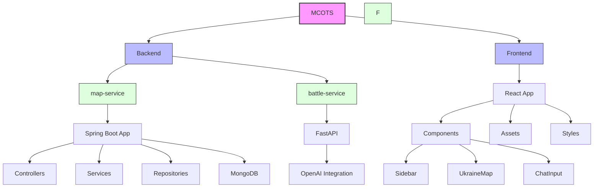

```mermaid
graph TD
    A[MCOTS] --> B[Backend]
    A --> C[Frontend]
    
    B --> D[map-service]
    B --> E[battle-service]
    
    D --> D1[Spring Boot App]
    D1 --> D2[Controllers]
    D1 --> D3[Services]
    D1 --> D4[Repositories]
    D1 --> D5[MongoDB]
    
    E --> E1[FastAPI]
    E1 --> E2[OpenAI Integration]
        
    C --> G[React App]
    G --> G1[Components]
    G1 --> G2[Sidebar]
    G1 --> G3[UkraineMap]
    G1 --> G4[ChatInput]
    
    G --> G5[Assets]
    G --> G6[Styles]
    
    style A fill:#f9f,stroke:#333,stroke-width:2px
    style B fill:#bbf,stroke:#333,stroke-width:1px
    style C fill:#bbf,stroke:#333,stroke-width:1px
    style D fill:#dfd,stroke:#333,stroke-width:1px
    style E fill:#dfd,stroke:#333,stroke-width:1px
    style F fill:#dfd,stroke:#333,stroke-width:1px
```
